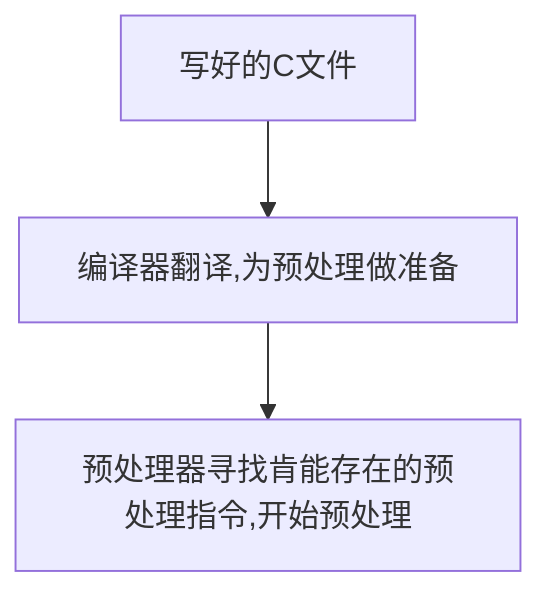

C源码编译期间的预处理器(Preprocessor)
<!--more-->

<center><iframe frameborder="no" border="0" marginwidth="0" marginheight="0" width=330 height=86 src="//music.163.com/outchain/player?type=2&id=550472081&auto=1&height=66"></iframe></center>

> 编译程序之前，先由预处理器检查程序（因此称为预处理器）。根据程序中使用的预处理器指令，预处理用符号缩略语所代表的内容替换程序中的缩略语。
> 预处理器可以根据你的请求包含其他文件，还可以让编译器处理哪些代码。预处理器不能理解C，它一般是接受一些文本并将其转换成其他文本。-- (C Primer Plus中文第五版)

<center>

</center>

## 预处理符号
###  明显常量 #define
`#define`定义的作用域从定义出现的位置开始直到文件的结尾。这里表明在函数里使用`#define`，凡是在它定义的后面的所有函数都是可以用的：
```c
#include <stdio.h>
void pp();
int main() {
    #define FF 10
    pp();
}

void pp(){
    printf("FF: %d ",FF);
}
```
输出：
```
FF: 10
```
要时刻记住：**`#define`会把它之后的文件里的所有符合要求的文本替换掉。**
每个`#define`行由三部分组成：
* 指令自身 `#define`
* 缩略语，即宏(macro)
宏的名字中不允许有空格，必须遵循C变量名规则
* 替换列表或者主体(body)

预处理器在程序中发现了宏的实例后，总会用实体代替该宏。从宏变成最终的替换文本的过程称为宏展开(macro expansion)。
宏可以分两种：
* 类对象宏 object-like macro
宏用来代表值
* 类函数宏 function-like macro
外形和作用都与函数相似

```c
#define TWO 2;
#define PX printf("X is: %d\n",x)
#define FMT "X+1 is: %d\n"


int main() {
    int x =TWO;
    PX;
    printf(FMT,x+1);
}
```
输出：
```
X is: 2
X+1 is: 3
```
上面的程序其实被预处理器改成了：
```c
int x = 2;
printf("X is: %d\n",x);
printf("X+1 is: %d\n",x+1);
//先变成int y = TWO * TWO;
int y = 2*2;
printf("y is: %d\n",y);
```
注意，宏展开过程中，是进行替换，并不进行计算。`C编译器在编译时对所有常量表达式（只包含常量的表达式）求值，所以实际相乘过程发生在编译阶段，而不是预处理阶段。预处理器不进行计算，它只是按照指令进行文字替换操作。`
**宏展开过程中，会用宏的等价（即`body`）来替换文本，如果宏的`body`本身还含有宏的话，会继续展开这些宏。但是，双引号中的与宏缩略语一样的字符串无法被替换。**
#### 重定义常量
假设一个缩略语被定义后又在同文件中被定义，这样被称为重定义(redefinng a constant)。有的编译器会对这样提出警告，但允许重定义存在，有的则直接报错。
```c
#define SIX 3 * 3
#define SIX 3   *   3
//上面这样的重定义会被编译器认为是重复定义，是相同的

#define SIX 3*3
//这样的重定义与上面两种是不同的
```
#### 在`#define`中使用参数

类函数宏的定义中，用圆括号阔气一个或多个参数，随后这些参数出现在替换部分。
```c
#define SQUARE(X) X*X
//一个参数X

//使用
int y = SQUARE(2);
```
宏调用和函数调用存在着区别：
程序运行时，函数调用把参数的值传递给函数，而编译前，宏调用把参数的语言符号传递给程序，仅仅是替换字符，而不计算。
```c
#define  SQUARE(X) X*X
int main() {
    int x = 2;
    int y = SQUARE(x);
    printf("SQUARE(x) is: %d\n",y);
    printf("SQUARE(x+2) is: %d\n",SQUARE(x+2));
}

```
输出：
```
SQUARE(x) is: 4
SQUARE(x+2) is: 8
```
按理说`square(2+2)`应该是16啊，怎么会是8呢？原来像刚才上面说的，预处理只是替换，因此`SQUARE(x+2)`中的`X`被`x+2`替换，最后成了`x+2*x+2`。`*`优先级高，，因此程序运行时先计算`2*x`，再加上`x`和`2`，也就成了`8`。要想实现平方的效果，需要重新定义：
```c
#define SQUARE(X) ((X)*(X))
```
即使这样定义，还是无法避免自增、自减情况下的错误:
```c
int x = 3;
int a = SQUARE(++x);
```
这里替换成`++x`字符后，进行了两次增量运算，最后结果肯定不是平方了。因此，**在宏中不要使用增量或减量运算符**。**而且一定要充分的使用圆括号来保证正确的运算顺序**。
##### 在类函数宏中使用`#`运算符
上面说了在引号表示的字符串无法替换掉宏参数，，但是使用`#`预处理运算符，可以把传入的参量转化为文本替换到字符串里。
```c
#define SQUARE(X) (X)*(X)

#define PF(X) printf("The square of " #X " is : %d\n",SQUARE(X))
int main() {
    int x = 10;
    PF(x);
    PF(2+4);
}
```
输出：
```
The square of x is : 100
The square of 2+4 is : 36
```
##### 在宏中使用`##`运算符
`##`运算符把两个语言符号组合成单个语言符号：
```c
#define XVAR(X) x ## X

int XVAR(2) = 11;//声明了一个标识符为x2的变量
```
##### 可变宏：`...`和`__VA_ARGS__`
宏定义中参数列表的最后一个参数为省略号，预定义宏`__VA_ARGS_`就可以被用在替换部分，以代表省略号省略了什么。
```c
#define PF(X,...) printf("Result " #X " : " __VA_ARGS__)

int main() {
    PF(1,"%d\n",10);
    PF(2,"%d's power is %d\n",4,16);
}
```
输出：
```
Result 1 : 10
Result 2 : 4's power is 16
```
省略号只能代替最后的宏参数。
```c
#define WRONG(X, ... ,Y) #X #__VA_ARGS__ #Y)//错误
```
这里有个有趣的现象：一般想要打印字符串，字符串都得用双引号括起来，这里不用：
```c
#define STRING(... ) #__VA_ARGS__

int main() {
    printf(STRING(abcdefg));
}
```
输出：
```
abcdefg
```
